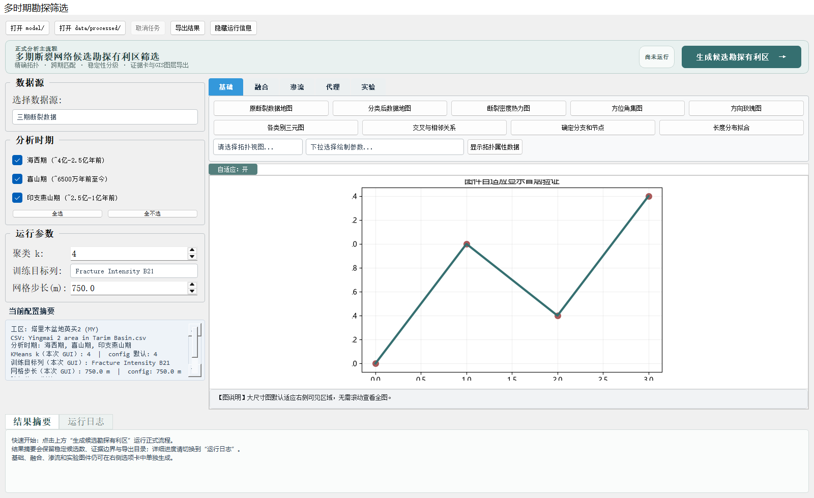

# 多期断裂网络拓扑智能融合与候选勘探有利区筛选系统

面向多期断裂网络数据的拓扑分析、跨期融合、候选勘探有利区筛选与证据化导出系统。

项目将海西期、喜山期和印支—燕山期断裂数据统一到可复核的分析流程中，通过精确拓扑指标、跨期空间匹配、透明评分和参数稳定性检验，生成供地质人员进一步复核的候选区；同时保留原有专业绘图、渗流分析和代理模型实验功能。

> 本系统提供的是内部数据驱动的候选区筛选结果，不直接等同于油气发现概率。接入井位、储层、产量或专家盲评数据前，外部有效性保持未验证状态。



## 核心能力

- **一键正式筛选**：GUI 首屏提供醒目的“生成候选勘探有利区”入口，CLI 与 GUI 复用同一条正式管线。
- **精确拓扑分析**：按时期构建断裂网格图，计算介数中心性、PageRank 和节点移除影响等指标。
- **跨期确定性匹配**：在距离容差内执行一对一匹配，保证同一匹配单元中每个时期最多出现一个节点。
- **透明候选评分**：综合网络关键性、节点移除影响、时期持续性和参数稳定性，不使用黑箱代理模型参与正式决策。
- **稳定性分级**：使用 `inverse`、`inverse_sqrt` 和 `neglog` 三种距离变换复算排序，并区分稳定候选与不稳定候选。
- **空间限径聚合**：候选单元聚合时限制区域最大直径，避免密度连接造成不合理的链式大区域。
- **证据化导出**：输出 CSV、JSON、Markdown、PNG 和 GeoPackage，便于复核、汇报和后续 GIS 对接。
- **专业图件保留**：继续支持原始数据图、分类图、密度热力图、方位角图、玫瑰图、三元图、拓扑关系图、关键节点图和轮廓图等分析功能。
- **自适应图件查看**：默认按可用窗口等比例缩放图片，也可切换到原始尺寸滚动检查细节。

## 正式筛选流程

```text
三期断裂网格数据
      ↓
分期精确拓扑分析
      ↓
跨期一对一空间匹配
      ↓
候选单元透明评分
      ↓
限径空间聚合
      ↓
多参数稳定性分级
      ↓
候选区图件、证据卡与 GIS 数据导出
```

正式流程位于 `program/screening_pipeline.py`，不导入 `agent_model.py`。代理模型、SHAP、渗流模拟等功能保留在研究与专业分析入口，用于对比实验，不作为正式候选区评分依据。

## 快速开始

### 1. 环境准备

推荐使用 Python 3.10 或 3.11；项目配置声明支持 Python `>=3.9,<3.13`。

```powershell
git clone https://github.com/flyningggg/multi-stage-fault-fusion-prediction.git
cd multi-stage-fault-fusion-prediction

python -m venv .venv
.\.venv\Scripts\Activate.ps1
python -m pip install --upgrade pip
python -m pip install -r requirements.txt
```

### 2. 启动 GUI

```powershell
.\.venv\Scripts\python.exe program\main.py
```

在主界面确认数据源、分析时期和网格参数后，点击顶部主操作卡中的“生成候选勘探有利区”。运行结果摘要和日志位于右侧图件区下方，可按需展开或收起。

### 3. 使用 CLI 运行正式筛选

```powershell
.\.venv\Scripts\python.exe scripts\run_target_screening.py `
  --config program\config.yaml `
  --output artifacts\screening\latest
```

默认会完整计算三期拓扑指标。只有在配置哈希完全一致时，才可通过 `--reuse-period-metrics-from` 复用既有时期指标。

### 4. 运行测试

```powershell
.\.venv\Scripts\python.exe -m pip install -r requirements-dev.txt
.\.venv\Scripts\python.exe -m pytest -q
```

当前合并版本的完整测试结果为：`100 passed`。

## 输入数据与配置

仓库包含三期示例 CSV：

- `program/海西期.csv`：3599 个有效网格；
- `program/喜山期.csv`：2793 个有效网格；
- `program/印支燕山期.csv`：3480 个有效网格。

正式筛选参数集中在 `program/config.yaml` 的 `screening` 节点，包括：

- 边权属性与距离变换；
- 候选分位数和最少支持时期数；
- 综合评分权重；
- 空间聚合半径、最小样本数和最大直径；
- 外部验证数据及缓冲距离。

源 CSV 当前未声明坐标参考系。导出的 GeoPackage 保留原始米制坐标，但在与井位或其他地质图层叠加前必须人工确认 CRS。

## 输出结果

每次正式运行会生成：

```text
output/
├── result.json                    # 完整结构化结果
├── report.md                      # 本次分析报告
├── manifest.json                  # 环境、配置哈希与运行记录
├── config_snapshot.yaml           # 配置快照
├── candidate_cells.csv            # 候选单元
├── matched_cells.csv              # 跨期匹配单元
├── candidate_targets.csv          # 全部候选空间组
├── stable_candidate_targets.csv   # 稳定候选空间组
├── candidate_targets.gpkg         # GIS 图层
├── evidence_cards.json            # 逐候选区证据卡
└── maps/candidate_targets.png     # 候选区图件
```

GeoPackage 同时提供 `all_candidate_targets` 和 `stable_candidate_targets` 两个图层，方便将全部候选与稳定候选分开复核。

## 当前验证结果

仓库中的 `artifacts/experiment/target-screening-mvp-v1/final/` 保存了一次三期真实数据审计结果：

| 指标 | 数值 |
| --- | ---: |
| 三期有效网格 | 9872 |
| 跨期匹配单元 | 6392 |
| 候选单元 | 696 |
| 候选空间组 | 59 |
| 稳定候选 | 9 |
| 不稳定候选，仅供复核 | 50 |
| 外部验证状态 | `not_validated` |

上述数字用于证明管线能够在当前数据上完整运行，不应被表述为已发现 9 个油气藏或已经验证的钻探靶区。详细边界和失败修正记录见：

- `artifacts/experiment/target-screening-mvp-v1/RUN.md`
- `artifacts/experiment/target-screening-mvp-v1/SELF_AUDIT.md`
- `artifacts/experiment/target-screening-mvp-v1/UI_DECISION.md`

## 目录结构

```text
program/
├── main.py                    # GUI 主程序
├── screening_pipeline.py      # 正式候选区筛选总管线
├── candidate_targeting.py     # 跨期匹配、评分与空间聚合
├── screening_contracts.py     # 正式流程合同与异常定义
├── external_validation.py     # 外部井位/标签验证接口
├── batch_run.py               # 批量分析与研究流程
├── multiperiod_overlay.py     # 多期空间叠加
├── percolation.py             # 渗流与关键节点实验
├── agent_model.py             # 研究用代理模型
├── topology_fusion.py         # 拓扑融合算法
├── config.yaml                # 统一配置
└── utils/                     # 通用工具

scripts/
├── run_target_screening.py    # 正式筛选 CLI
├── capture_gui_preview.py     # GUI 布局与缩放冒烟验证
├── run_correctness_v1.py      # 正确性审计脚本
└── run_validation_v2.py       # 稳定性验证脚本

tests/                         # 自动化测试
artifacts/experiment/          # 可复核实验与最终产物
```

## 后续优先事项

1. 确认三期数据的坐标参考系；
2. 接入真实井位、储层、产量或专家盲评标签；
3. 建立空间留出验证和候选区命中评价；
4. 在外部证据充分后，再讨论“油气预测”层面的效果指标。
